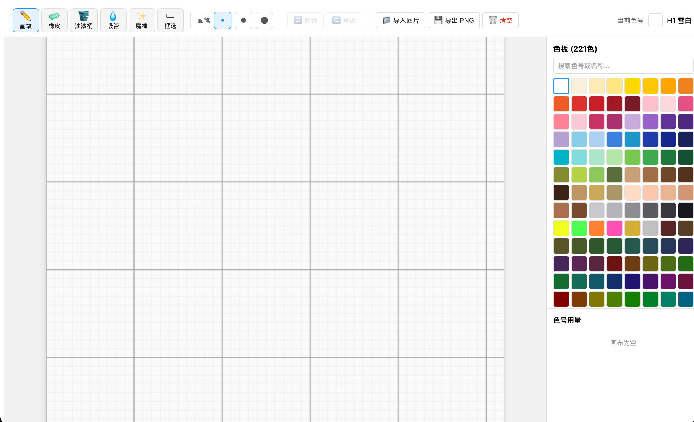

# MARD 拼豆图纸设计软件

专为 MARD 221 色拼豆设计的桌面图纸编辑工具，基于 Electron + React + TypeScript 构建。


---

## 软件界面



---

## 功能特性

### 绘图工具（推荐，效果最佳）

**手绘创作是本软件目前体验最好的功能。** 从空白画布开始，配合右侧 221 色板自由创作，所见即所得，色号一目了然。

- **画笔** — 单格或多格（1×1 / 3×3 / 5×5）涂色，虚线框实时显示画笔范围
- **橡皮** — 清除格子颜色
- **油漆桶** — 区域填充，一键涂满同色连通区域
- **吸管** — 点击画布取色，快速切换当前颜色
- **魔棒** — 智能选择相邻同色区域（全局模式：选出画布上所有该颜色的格子）
- **框选** — 矩形区域选取，支持删除选区、填充当前色
- **平移** — 拖动画布查看不同区域
- **缩放** — 支持 50% / 75% / 100% / 150% / 200% / 300% / 400% 多级缩放

### 画布辅助
- 每格显示对应 MARD 色号（如 H12），无需查表
- 每 10 格一条辅助线，方便计数和定位
- 右侧实时显示各颜色用量，方便备料

### 图片导入（效果有限，请合理预期）

> **坦诚说明：** 图片导入转换功能在工程上已尽力优化，但受 52×52 极低分辨率的本质限制，**复杂照片和细节丰富的图片转换效果普遍较差**。
>
> 将一张高清图"压缩"到 52×52 格、再映射到有限的 221 色，数学算法无法弥补信息损失，最终结果往往"认不出来"或颜色混乱。这不是 bug，而是低分辨率像素艺术的本质约束——即使是专业拼豆设计师也需要大量手工调整。
>
> **建议使用场景：** 线稿/卡通图（大色块、少细节）转换效果相对可接受；复杂照片建议只作为参考底图，主要靠手工修改。

图片导入提供的调节参数：
- **预设方案** — 普通照片 / 线稿插画 / 卡通彩图 / 简单图标
- **去除纯色背景** — 自动识别并清除白色等纯色背景
- **线条保留** — 智能下采样：优先保留细线而非平均掉（线稿/卡通必开）
- **对比度 / 亮度 / 饱和度** — 图像预处理
- **前处理模糊** — 减少导入后的噪点色块
- **清理孤立点** — 消除量化后零散的噪点格子
- **色彩简化** — K-means 聚合，适合色块简单的图标

### 导出图纸
- 导出高清 PNG 图纸
- 可调节每格像素大小（10px ~ 80px）
- 支持显示色号文字标注
- 支持黑白涂色版（只保留网格线和色号，方便手工对照）

### 其他
- 完整的撤销 / 重做历史（最多 50 步）
- 支持拖拽图片到窗口直接进入导入流程

---

## 画布规格

| 项目 | 参数 |
|------|------|
| 画布大小 | 52 × 52 格 |
| 颜色库 | MARD 221 色 |

---

## 开发环境运行

```bash
# 安装依赖
npm install

# 启动开发模式（浏览器）
npm run dev

# 启动 Electron 开发模式
npm run electron:dev
```

## 打包为 macOS 应用

```bash
npm run dist
```

打包完成后在 `release/` 目录下生成 `.dmg` 安装包。

---

## 技术栈

- [Electron](https://www.electronjs.org/) — 桌面应用框架
- [React 18](https://react.dev/) — UI 框架
- [TypeScript](https://www.typescriptlang.org/) — 类型安全
- [Vite](https://vitejs.dev/) — 构建工具
- [Zustand](https://zustand-demo.pmnd.rs/) — 状态管理

---

## 作者

huojianbin
